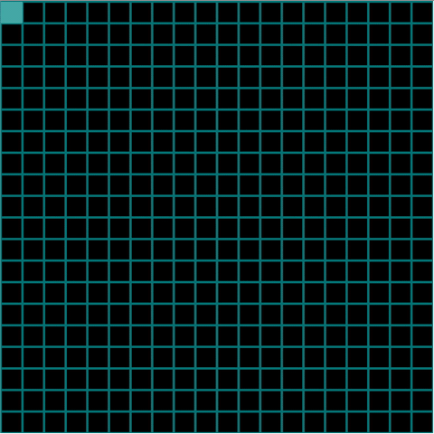

# Maze Generation Algorithms (Depth First Search with Backtracking) (Session 1)

# Description

This repository is the second [session of Maze Generation Algorithms](https://github.com/VusalIs/Maze-Generation-Algorithms-Session-0-) and will explain how you can implement Depth First Search with Backtracking to generate random maze. Let's get started:

-   [Demo](#demo)
-   [What is Depth First Search?](#What-is-Depth-First-Search)
-   [How you can implement Depth First Search with Backtracking for maze generation?](#How-you-can-implement Depth-First-Search-with-Backtracking-for-maze-generation)
-   [What is the code implementation?](#What-is-the-code-implementation?)
-   [Thanks for your attention](#Thanks-for-your-attention)

# Demo

This repository has all codes which I have used in the demo. You are Welcome to pull this repository and explore or edit it. Additionally, If you want to see live demo you can use following link:



# What is Depth First Search?

Depth First Search is algorithm to search or traverse in a tree or graph data structures. For finding two nodes are connected or not, the algorithm asks its left/right node if it is the second node or not. This process recursively continues till you reach the left/right most leaf(last element). After that, If the second node is not found, it goes one step back and try to find second node right/left child. This process continues till finding the second node. You can find detailed information in the following link(https://brilliant.org/wiki/depth-first-search-dfs/). As you see, this algorithm is not so useful for maze generation because we will get the same results if we start from the same point. That is why, we will change this algorithm slightly.

# How you can implement Depth First Search with Backtracking for maze generation?

As you see, Depth First Search has many disadvantages for maze generation, that is why we will slightly change algorithm. The first problem is randomness. In depth first search we start from left or right node, but if we want to create a complex maze, we have to add a randomness. Because of that, instead of choosing next node in the static direction, we will randomly choose the next node. Another problem is recursion. If we want to create large maze, the algorithm will reach large depth of recursion. Avoiding this problem, we will use stack and store all path in this stack instead of recursion. Our algorithm will work based on following order:

1. Choose the initial cell, mark it as visited and push it to the stack
1. While the stack is not empty
    1. Pop a cell from the stack and make it a current cell
    1. If the current cell has any neighbors which have not been visited
        1. Push the current cell to the stack
        1. Choose one of the unvisited neighbors
        1. Remove the wall between the current cell and the chosen cell
        1. Mark the chosen cell as visited and push it to the stack

# What is the code implementation?

I have already talk about basic file structure in the [session 0](https://github.com/VusalIs/Maze-Generation-Algorithms-Session-0-). Now It is time to code implementation of the algorithm.

```javascript
function algo() {
    var unvisitedNeighbors = currentCell.getUnvisitedNeighbors();
    var next = unvisitedNeighbors[Math.floor(Math.random() * unvisitedNeighbors.length)];
    if (next) {
        stack.push(currentCell);
        next.visited = true;
        removeWalls(currentCell, next);
        currentCell = next;
    } else if (stack.length > 0) {
        currentCell = stack.pop();
    }
}
```

As you see, code implementation of this algorithm is so short. Firstly, we find all unvisited neighbors of current cell and choose random neighbor. If there are no unvisited neighbors, that means we have visited all neighbors and have to move one step back in our stack. If there are unvisited neighbors, we add current cell to the stack and move to new cell.

# Thanks for your attention

Thanks for your attention! See you 👋
